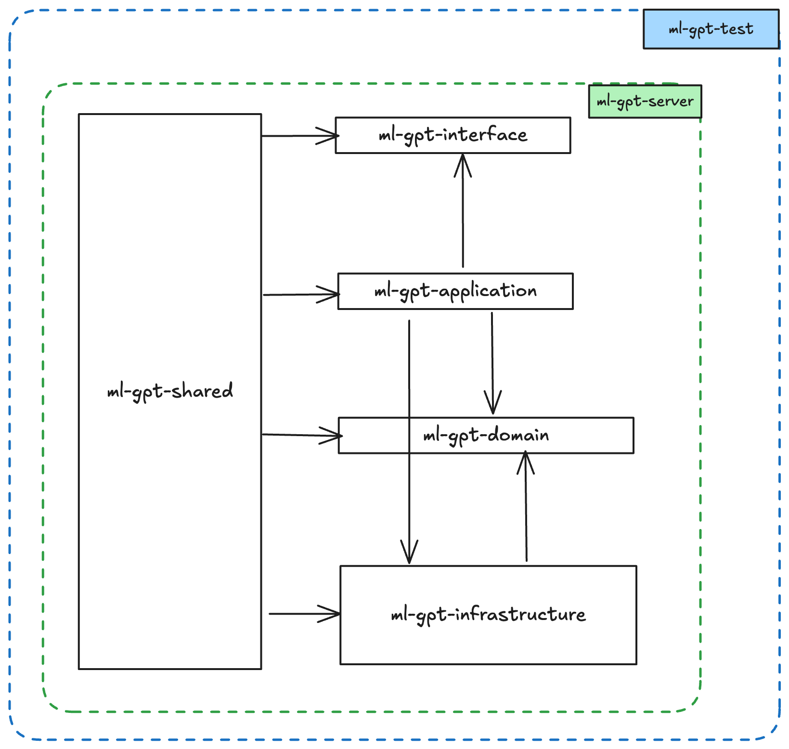
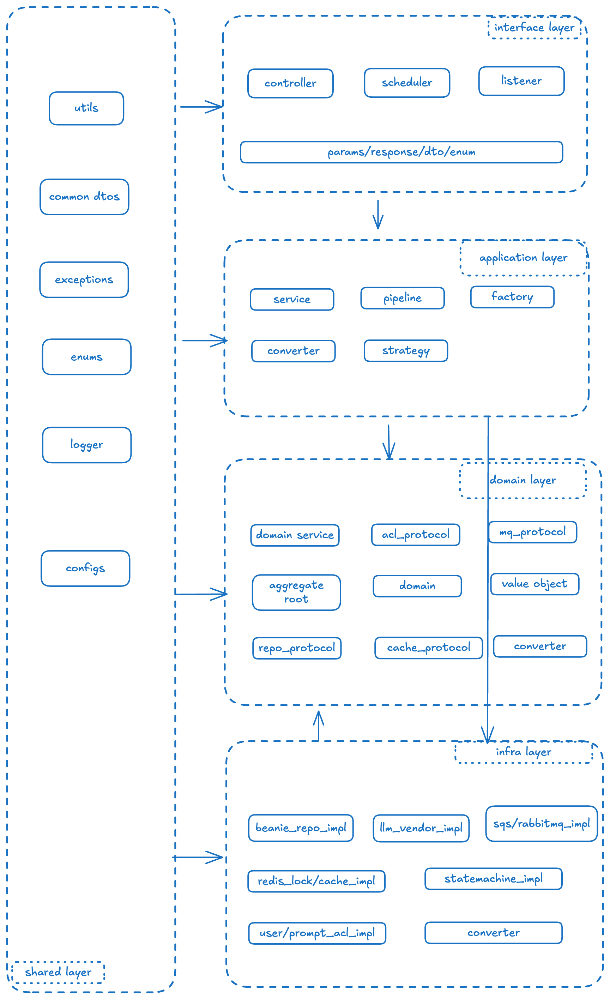

# DDD 分层架构



```javascript
-ml - gpt
- ml - gpt - interface
- ml - gpt - application
- ml - gpt - domain
- ml - gpt - infrastructure
- ml - gpt - shared
- ml - gpt - server
- ml - gpt - test
```

## 模块解释

- **ml-gpt-interface**: 接口层，主要是对外提供的接口,里面主要是系统的所有入口，何为入口？我们这里定义为：
    - **controller**: MVC 架构层的控制器，主要是对外提供的 Restful 风格的Endpoints.
    - **task**: 任务的创建和执行的入口,任务都执行可能是来自外部的 Aws Event-Bridge或者某个调度平台的调度等
    - **listener**: 监听器，主要是对外提供的消息队列的监听器，监听来自 SQS 或者其他消息队列的消息，然后在内部执行任务
      <br/>

      > 以上，入口的定义就是：暴露自身的Endpoint 给外部调用的地址 当然，除了这些还有一些Request的 Param/Response/DTO
      类和枚举类,这些也是为微服务
      RPC 定义的协议层的东西

- **ml-gpt-application**: 应用层，不会对外提供和暴露任何的细节，你可以理解为门面模式，封装了业务执行流程的细节，向上继承/依赖
  Interface 层
  实现其接口定义，封装业务调用细节，给出输出。最常见的就是我们的各种 Service 实现.它可能是这个项目中业务逻辑最复杂的地方，你需要调用不同的层的
  API
  去拼装完成你的业务，比如，你需要调用：
    ```js
      1. 调用 Infra 层的 LockService/LockClient 来加锁
      2. 调用 同级别的 Application 层的某个 AService/或者Pipeline 来拼装业务
      3. 调用 Infra 层的的 ACL（Anti-Corrosion Layer） 的某个 Adapter 调用外部的 API 来获取外部数据
      4. 调用 Domain 层的某个 DomainService 来完成核心业务逻辑
      5. 调用 Domain 层的某个 Repository 来完成数据的持久化（当然这个最终实现还是在 Infra 层）
    ```

- **ml-gpt-domain**: 领域层，主要是定义领域模型和领域服务的地方，领域模型就是我们业务的核心模型，比如任务模型，用户模型等。领域服务就是我们业务的核心逻辑，
  比如任务的执行，任务的状态管理等。<br/>
  > 领域层除了领域服务（DomainService）和领域模型（DomainModel）之外，还有一些其他的概念，这些大部分都是以抽象接口的形式存在，也就是说：
  领域层只负责协议定义，但负责具体实现，而实现交给 Infra层来完成。<br/>

  你可能会问，为什么要这样设计？<br/>

  >
  因为领域层是核心层，我们要最大限度的保证它的原子性，独立性，稳定性，我们不希望外部的任何实现细节的变动影响到内核，否则就会导致我们的系统极度的不稳定.<br/>

  举个例子： 我们的系统依赖 OPENAI 的文本生成服务来进行文本对答生成，势必会依赖 OPENAI 的 SDK
  进行接口协议对接，假设在没有防腐层或者领域接口层的概念下，
  我们的开发可能是直接在领域层直接调用 OPENAI 的 SDK 来完成文本生成的请求，这样一来，我们的领域层就会依赖于 OPENAI 的 SDK
  的协议和相关实体的定义。<br/>
  有一天，我们发现 OPENAI 的SDK
  版本升级了，或者对方内部对协议的入参和出餐进行了更改，比如要求我们必须多传入一个参数或者返回的结果多了一个字段等，这样一来，我们的领域层就会受到影响，我们需要修改领域层的代码，甚至可能会导致我们整个系统的崩溃.<br/>
  又或者说，我们需要集成另一个文本生成的服务，比如 Anthropic 的文本生成服务，我们需要在领域层中实现一个新的适配器来完成对接，如果没有充分测试和出现些许的
  bug，那么领域层就相当的不稳定<br/>

- **ml-gpt-infrastructure**:
  基础设施层，主要是实现领域层的协议定义，完成具体的实现，比如数据库的持久化，外部服务的调用等。<br/>
  可以说基层设置层囊括了所有的实现细节，比如：
    - **Repository**: 数据库的持久化实现，主要是实现领域层的 Repository 接口，完成数据的持久化和查询等操作，你可以用
      mongo、mysql、oracle 等任何底层数据库来支持实现，甚至可以同时实现和存在。
    - **Adapter**: 外部服务的调用实现，主要是实现领域层的 Adapter 接口，完成外部服务的调用和数据的转换等操作，比如调用
      OPENAI 的文本生成服务，或者调用 AWS 的 SQS 服务等，这一层主要就是防腐层的实现
    - **Cache**: 比如你可以用 Redis，设置 InMemory来实现，包括锁的实现
    - **Event**: 事件的实现，比如你可以用 RabbitMQ，Kafka 来实现事件的发布和订阅等操作
    - **Lock**: 锁的实现，比如你可以用 Redis，Zookeeper 来实现分布式锁的实现
    - **ACL**: 防腐层的实现，比如你可以用 Adapter 来实现对外部服务的调用和数据的转换等操作
    - **Client**: 其他的 client，可以是 httpclient 或者 Posthog 这种 featureFlag 系统
    - **Config**: 配置的实现，比如你可以用 AWS SSM，或者其他的配置中心来实现配置的加载和管理等操作

  > 细心你就会发现，这一层的实现都是跟底层的中间件相关的，这是一种面向底层驱动开发的无任何业务逻辑在里面的实现。同时，它继承自 domain 协议层，
  > 对外暴露统一的接口协议，对内则封装不同的中间件实现差异.只要你的 domain 层不变，理论上你的业务受到的冲击就很小

- **ml-gpt-shared**: 共享层，主要是一些公共的工具类和公共的配置等，比如日志的实现，异常的处理等。<br/>
  当然你可以将某些 Util 类甚至是Endpoint 的协议参数类，还有跨多个层的公共 DTO 类都放在这里。这一层支援所有的层的依赖。

- **ml-gpt-server**: 服务器层，主要是启动和配置的实现，比如启动 FastAPI 的应用，配置中间件，注册路由，配置日志等。<br/>

- **ml-gpt-test**: 测试层，主要是单元测试和集成测试的实现，比如使用 pytest 来实现单元测试和集成测试等。<br/>
  将一些 Mock 的实现放在这里，比如 Mock 的数据，Mock 的服务等，这一层主要是为了方便测试和调试等操作。我的建议是将测试类放在同样的目录下。


---

## 依赖关系

- **Layer Shared** ：提供支持给所有的其他层，因此它必须是一个公共的资源库，不能依赖其他的层，这里面最好不要写任何非独立的代码，比如这样的一个 BadCase:
```python
  class A:
    def __init__(self):
        config=load_config_from_third_party()
    
    pass    
    
```
你在里面写了一个组件类，但是在构造函数中依赖了需要读取外部服务,这种是强烈不推荐的，首先这是一种强依赖，其次，这会导致你的 shared 包直接依赖了
外部的服务，并且是启动初始化这个类实例的时候,如果外部服务不可用，那么你的 shared 包就会无法使用了，这种是非常不推荐的做法。<br/>
因为你的 shared 包可能会被打包给其他的项目使用，假设你有一个 shared 包是一个公共的工具类库，你的其他项目也依赖了这个包，那么你的其他项目也会受到影响.<br/>


- **Layer Interface**：依赖 Application,因为你需要在 controller 调用某个 Service 去完成业务逻辑
- **Layer Application**：依赖 Domain,因为你需要在 Service 中调用 Domain 的接口
- **Layer Domain**：无依赖，或者说只依赖系统组件，比如说你可以在 Domain 层中使用 Python 的内置库，比如 datetime、json 等等
- **Layer Infrastructure**：依赖 Domain,因为你需要在 Repository 中实现 Domain 的接口，然后依赖任何第三方的 SDK
- **Layer Server**：依赖 Application即可，因为依赖会传递，所以导致 server 会依赖整个项目的其他所有层
- **Layer Test**：依赖所有的层，因为你需要在测试中调用所有的层的接口和实现

--- 
## 总结
最后，我们来看下每一层都应该包含哪些内容


